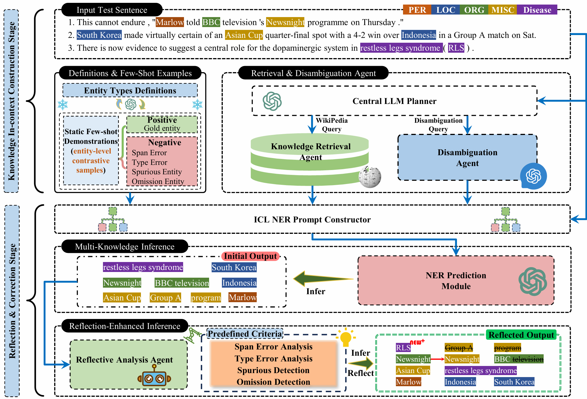

---

# KDR-Agent
**AAAI 2026 Paper**: *KDR-Agent — a Multi-Agent LLM Framework for Low-Resource, Multi-Domain NER.*

KDR-Agent is a multi-agent LLM framework designed for **low-resource, multi-domain Named Entity Recognition (NER)**.
The core idea is: **“understand before recognizing, and self-correct through reflection.”**

---

## 🏗️ Architecture

<p align="center">
  
</p>

**Figure:** Overview of KDR-Agent.

---

## 🚀 Quick Start

### 1. 📦Dependencies

You can install all required packages via:

```bash
pip install -r requirements.txt
```

### 2. 🔑Set up OpenAI API Key

```bash
export OPENAI_API_KEY="sk-xxx"
```

Read it in Python:

```python
openai.api_key = os.getenv("OPENAI_API_KEY")

```

---

### 3. ⚙️Configuration

Example config file:`./config/Bio_BC5CDR.json`

```json
{
  "dataset": "Bio_BC5CDR",
  "test_file_path": "./data/Bio_BC5CDR/test_sample.json",
  "save_file_path": "./data/Bio_BC5CDR/test_sample.json",
  "model_name": "gpt-4o",
  "api_keys": "sk-*********************************",
  "max_loop": 10
}
```

Parameter description:

| Parameter        | Description                                            |
| ---------------- | ------------------------------------------------------ |
| `dataset`        | Dataset name                                           |
| `test_file_path` | Path to the test set (json)                            |
| `save_file_path` | Path to save predictions (will overwrite / write back) |
| `model_name`     | LLM name, e.g., `gpt-4o`                               |
| `api_keys`       | OpenAI API Key (can be replaced by env var)            |
| `max_loop`       | Maximum retry times when JSON schema validation fails  |

---

### 4. 🚀Run

```bash
python main.py --args_file ./config/Bio_BC5CDR.json
```

After running, you will get:

* Updated `test_sample.json` with predictions
* Precision / Recall / F1

---

## 📄 Data Format

The input file `test_file_path` should be a JSON list. Each sample contains at least:

```json
[
  {
    "sentence": "Docetaxel was compared with paclitaxel in breast cancer.",
    "entities": [
      {"name": "Docetaxel", "type": "Chemical"},
      {"name": "paclitaxel", "type": "Chemical"},
      {"name": "breast cancer", "type": "Disease"}
    ]
  }
]
```

The output will append a prediction field for each sample:

```json
"predicts": [
  {"name": "...", "type": "..."}
]
```

---

## 📊 Evaluation

We compute metrics using `get_PRF(test_data)`:

* **P (Precision)**
* **R (Recall)**
* **F1**

You may replace it with your preferred evaluation method in `tool.py`
(e.g., strict match / partial match / span-level evaluation).

---

## 🧩 Project Structure

```text
KDR-Agent/
├─ main.py
├─ arguments.py
├─ tool.py
├─ config/
│  └─ Bio_BC5CDR.json
├─ data/
│  └─ Bio_BC5CDR/
│     ├─ test_sample.json
│     └─ ...
└─ README.md
```

---

## 🔧 Adapting to New Datasets

To extend KDR-Agent to a new dataset:

1. Add corresponding prompt templates in `tool.py`:

   * `get_palnner_prompt`
   * `get_first_NER_prompt`
   * `get_reflection_prompt`

2. Make sure the dataset follows the same JSON format.

3. Create a new config JSON file.

---

## 📚 Wikipedia Retrieval

We use the **Python `wikipedia` API** to fetch short summaries as background knowledge.
Retrieval follows a **robust fallback calling strategy**: we first try an automatic fuzzy/auto-suggest lookup, and if the concept is ambiguous or not found, we fall back to candidate pages from disambiguation or search results.
This ensures stable Wikipedia context acquisition for rare, noisy, or multi-meaning entity mentions.

---

## 📌 Notes

* If the LLM sometimes produces invalid JSON, consider:

  * Increasing `max_loop`
  * Strengthening schema constraints in prompts

---
