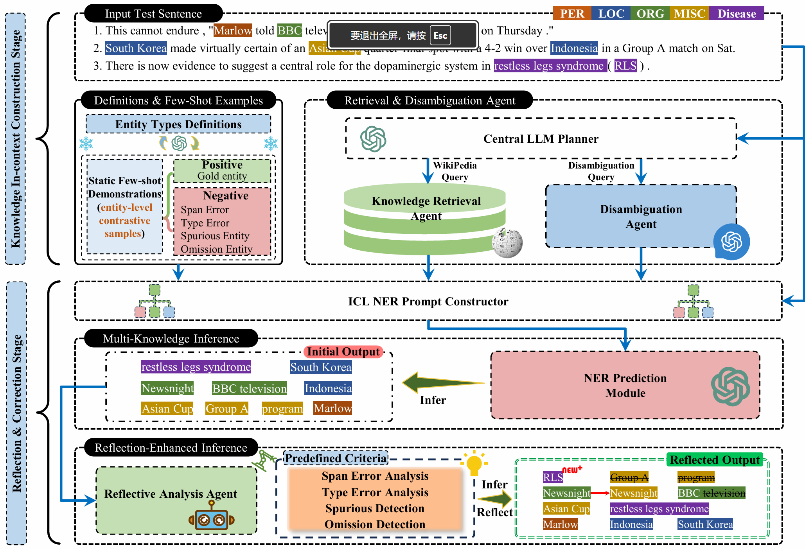

---

# KDR-Agent

**AAAI 2026 Paper**: *KDR-Agent — a Multi-Agent LLM Framework for Low-Resource, Multi-Domain NER.*

KDR-Agent 是一个面向 **低资源、多领域命名实体识别（NER）** 的多智能体（Multi-Agent）LLM 框架。
框架核心思想是：**“先理解再识别，并用反思自我纠正”**。

---

## 🏗️ Architecture

<p align="center">
  
</p>

**Figure:** Overview of KDR-Agent.

---

## 🚀 快速开始

### 1. 配置 OpenAI Key

你可以在代码里写死（不推荐），也可以通过环境变量：

```bash
export OPENAI_API_KEY="sk-xxx"
```

然后在代码中读取：

```python
openai.api_key = os.getenv("OPENAI_API_KEY")
```

---

### 2. 配置参数

`./config/Bio_BC5CDR.json` 示例（示例配置）：

```json
{
  "dataset": "Bio_BC5CDR",
  "test_file_path": "./data/Bio_BC5CDR/test_sample.json",
  "save_file_path": "./data/Bio_BC5CDR/test_sample.json",
  "model_name": "gpt-4o",
  "api_keys": "sk-*********************************",
  "max_loop": 10
}
```

参数说明：

| 参数               | 说明                       |
| ---------------- | ------------------------ |
| `dataset`        | 数据集名称，用于选择 prompt 模板     |
| `test_file_path` | 测试集路径（json）              |
| `save_file_path` | 预测保存路径（会覆盖/写回）           |
| `model_name`     | 使用的 LLM 名称，比如 `gpt-4o`   |
| `api_keys`       | OpenAI API Key（可用环境变量替代） |
| `max_loop`       | schema 校验失败时最大重试次数       |

---

### 3. 运行

```bash
python main.py --args_file ./config/Bio_BC5CDR.json
```

运行结束会输出：

* 保存后的 `test_sample.json`
* Precision / Recall / F1

---

## 📄 数据格式

输入 `test_file_path` 为 list 格式 JSON，每条样本至少包含：

```json
[
  {
    "sentence": "Docetaxel was compared with paclitaxel in breast cancer.",
    "entities": [
      {"name": "Docetaxel", "type": "Chemical"},
      {"name": "paclitaxel", "type": "Chemical"},
      {"name": "breast cancer", "type": "Disease"}
    ]
  }
]
```

输出会在每条样本附加：

```json
"predicts": [
  {"name": "...", "type": "..."}
]
```

---

## 📊 评估指标

项目使用 `get_PRF(test_data)` 计算：

* **P (Precision)**
* **R (Recall)**
* **F1**

你可以在 `tool.py` 中替换为你需要的评估方式（strict / partial match / span-level 等）。

---

## 🧩 项目结构

```text
KDR-Agent/
├─ main.py
├─ arguments.py
├─ tool.py
├─ config/
│  └─ Bio_BC5CDR.json
├─ data/
│  └─ Bio_BC5CDR/
│     ├─ test_sample.json
│     └─ ...
└─ README.md
```

---

## 🔧 自定义到新数据集

你只需要：

1. 在 `tool.py` 中添加对应数据集的 prompt 模板：

   * `get_palnner_prompt`
   * `get_first_NER_prompt`
   * `get_reflection_prompt`

2. 确保数据格式一致

3. 写一个新配置 json

---

## 📌 注意事项

* 如果 LLM 输出 JSON 不稳定，请：

  * 增大 `max_loop`
  * 或修改 prompt 的约束

---
